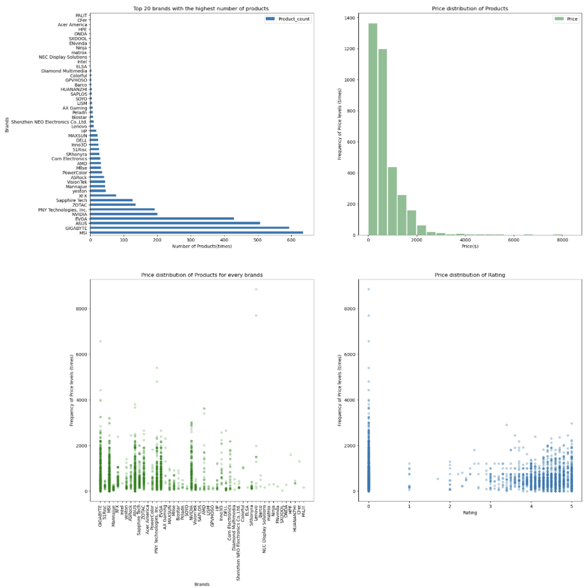

# GPU Information Collection and Visualization

## Problem Statement

In light of the recent decline in cryptocurrencies such as Bitcoin and other virtual currencies, the company seeks to gather insights into graphics cards through a dedicated website. The Data Engineer team is tasked with collecting and aggregating information from the product listings available on the [Newegg website](https://www.newegg.com). The goal is to provide the Business team with a comprehensive dataset for analysis and decision-making in launching new campaigns.

## Requirements

### Data Collection and Storage
- **Collect_Data_MySQL:** A script to scrape and collect data from the [Newegg GPUs and Video Graphics Cards category](https://www.newegg.com/GPUs-Video-Graphics-Cards/SubCategory/ID-48?Tid=7709) and store it in the Project2 database.

### Data Visualization
- **Visualization.ipynb:** A Jupyter Notebook containing code to visualize the data stored in the Project2 database. This includes graphs, charts, and insights that can aid in understanding the collected information.

### Database Schema
- **db_Prod.sql:** This SQL file provides the database schema and structure for the Project2 database. It outlines the tables and relationships necessary to store and organize the collected GPU information.

## Usage

1. **Data Collection and Storage:**
   - Run the `Collect_Data_MySQL` script to scrape and gather data from the Newegg website.
   - The collected data will be stored in the Project2 database.

2. **Data Visualization:**
   - Open the `Visualization.ipynb` Jupyter Notebook to visualize and explore the data stored in the Project2 database.
   - Utilize graphs, charts, and analyses provided in the notebook to gain insights into the collected GPU information.

## Notes

- The `Collect_Data_MySQL` script employs web scraping techniques to gather GPU information from the Newegg website.
- The `Visualization.ipynb` notebook serves as a tool to visually interpret the collected data for actionable insights.
- The `db_Prod.sql` SQL file defines the database structure for Project2 and serves as a foundation for data storage and organization.
- Ensure adherence to ethical scraping practices and respect for website terms of use during data collection.
- This repository exemplifies the collaboration between Data Engineers and Business teams, supporting informed decision-making.
